# PARENT CONTROL ISTRUZIONI PER L’USO
## Guida Pratica per Genitori

---

# Agenda del Seminario

1. **🛡️ Best Practices**
2. **🌐 Filtri DNS con NextDNS**
3. **🍎 iOS - Controlli Parentali**
4. **🤖 Android - Controlli Parentali**
5. **🖥️ Altre App**
6. **⚡ Domande e Risposte e Risoluzione Problemi**

---

# ✨ La Speranza

---

# 😧 La Dura Realtà

---

# 😧 La Dura Realtà

## 📚 **L'educazione è la cosa più importante**
- L'informatica è in evoluzione costante
- Limiti e filtri hanno un'efficacia limitata se non si capiscono i meccanismi alla base
- Non esiste la baccheta magica
- Tante app, tanti servizi, tanti strumenti, tanti possibili problemi

---

# 🛡️ Best Practices di Utilizzo

## 📢 **Limitare le notifiche**
- Sono progettate per distrarci e iniziare il feedback loop della dopamina 

## 💳 **Disabilitare acquisti in-app**
- Facilitano i comportamenti che creano dipendenza ed è facile spendere troppo

## 🎮 **Evitare se possible giochi free to play e servizi gratuiti**
- Implementano funzionalità discutibili per convincere a spendere

---

# 🛡️ Best Practices di Sicurezza

## 📱 **Aggiornamenti sistema**
- **Sempre attivi:** Impostazioni → Aggiornamenti automatici

## 🔐 **Password manager familiare**
- **Raccomandati:** Bitwarden, 1Password
- **Vantaggi:** Password uniche e sicure per tutti

## 🔒 **Autenticazione a due fattori (2FA)**
- Attivare su tutti gli account principali (Google, Apple, mail, social)
- Usare app authenticator invece di SMS

---

# 🌐 Cosa sono i Filtri DNS?

## 🔍 **DNS Spiegato Semplice**
- **DNS = "Elenco telefonico di Internet"**
- Traduce nomi siti comprensibli alle persone (google.com) in indirizzi numerici comprensibili ai computer
- **Controllo DNS = Controllo accessi web**

## 🛡️ **Filtri DNS**
- Blocco automatico siti non desiderati
- Funziona su tutti i dispositivi della casa senza necessità di installare app
- Blocco "leggero": funziona bene, ma ha capacità limitate ed è aggirabile

---

# 🌐 nextdns.io

## 😇 **Il buono**
- **Blocco per categoria:** Pornografia, violenza, pirateria, ...
- **Blocco app specifiche:** Facebook, TikTok, Fortnite, ...
- **SafeSearch forzato:** Su Google, Bing, YouTube
- **YouTube Restricted Mode:** Filtra video per un pubblico maturo e rimuove i commenti
- **Blocco pubblicità:** Impedisce di visualizzare la maggiorparte delle pubblicità online
- **Orari di accesso:** Controllo per fasce orarie
- **Dashboard:** Visualizza log e statistiche

---

# 🌐 nextdns.io

## 🧟‍♂️ **Il brutto**
- **Servizio freemiun:** gratuito per funzioni di base, a pagamento per funzioni avanzate
- **Non ha funzionalità avanzate:** gestione oraria rudimentale, log molto semplici, ...

## 👺 **Il cattivo**
- **È un servizio terzo:** aggiungiamo una dipendenza

## ✨ **Le alternative**
- **Esistono alternative:** Pi-hole

---

# Soluzioni Disponibili Per Parental Control

## 🍎 **iOS**
- **Tempo di utilizzo** (controllo completo)
- **In famiglia** (gestione familiare)

## 🤖 **Android**
- **Google Family Link** (supervisione completa)
- **Controlli Google Play** (restrizioni acquisti)

## 🧩 **Soluzioni terze parti**
- Non trattate oggi

---

# iOS: Configurazione Pratica

## 🔧 Configurazione Base
1. Dal telefono genitori **Impostazioni** → **Famiglia**
(si può fare direttamente sul telefono del figlio con **Impostazioni** → **Tempo di Utilizzo**)
2. Impostare il PIN!
3. Creazione nuovo **profilo minore**
4. Impostazione **pausa di utilizzo**
5. Applicazioni **sempre consentite**
6. Limiti **applicazioni**
7. Limiti **contenuti**

---

# 🧑‍🧑‍🧒‍🧒 Famiglia

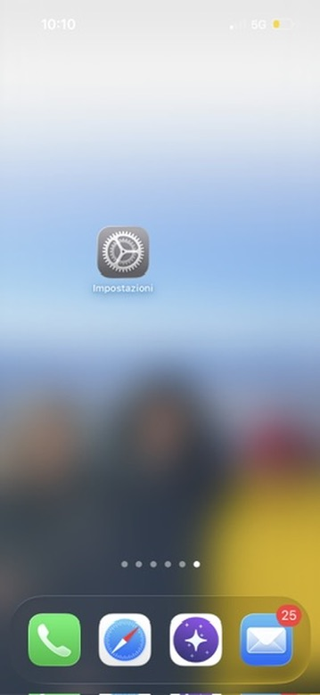

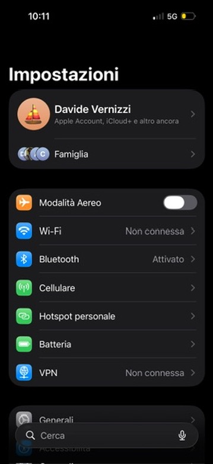

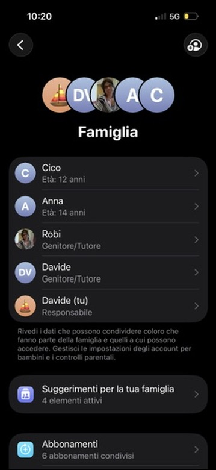

---

# 👶 Nuovo Profilo Minore

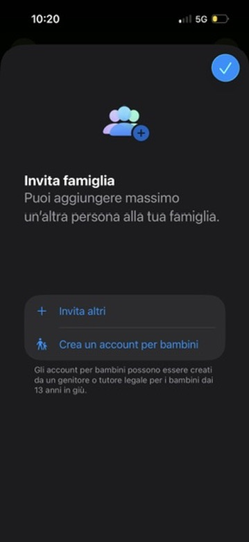

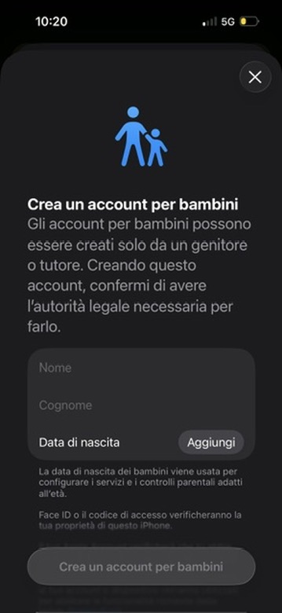

---

# 👶 Profilo Minore

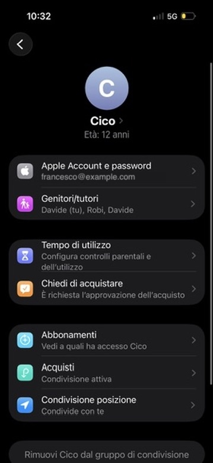

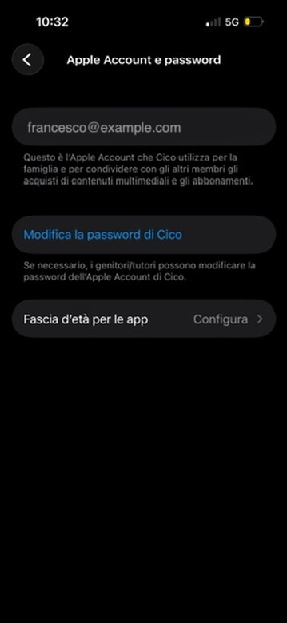

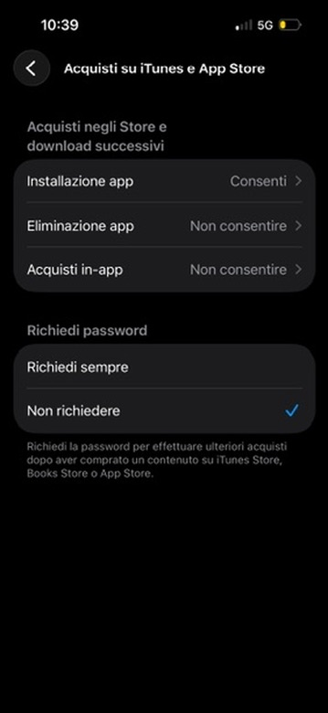

---

# ⏳ Limiti Utilizzo

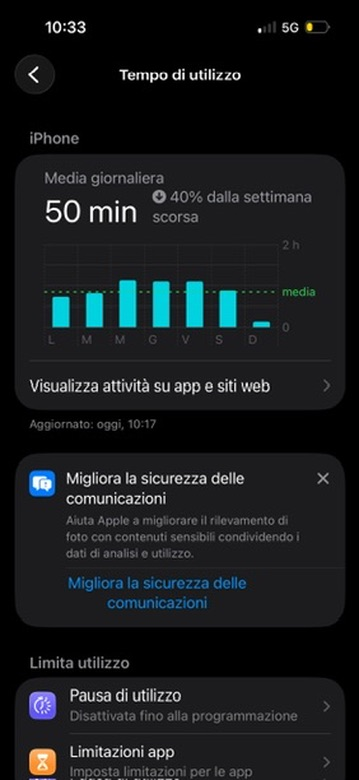

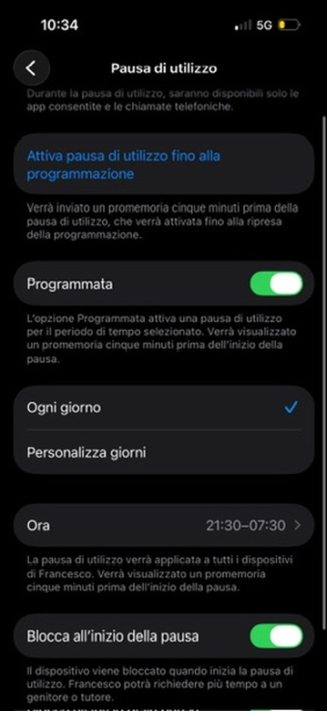

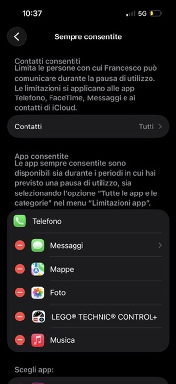

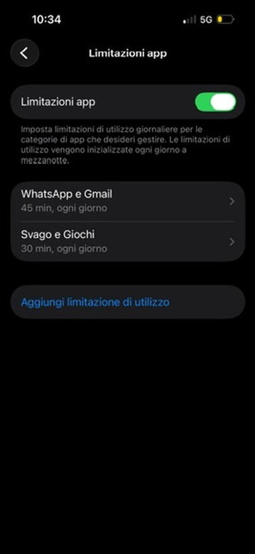

---

# ⏳ Nuovo Limite Utilizzo

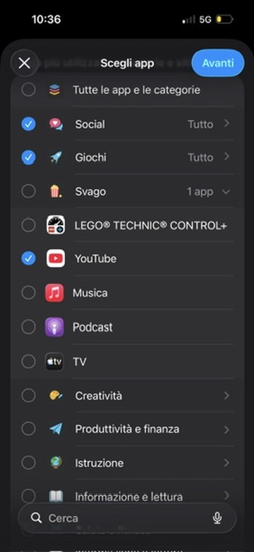

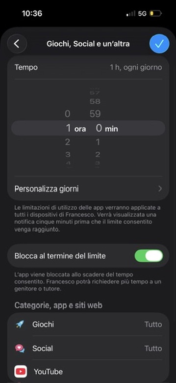

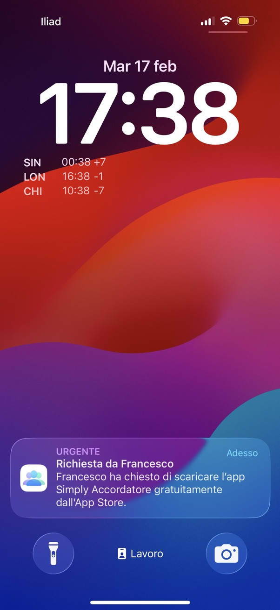

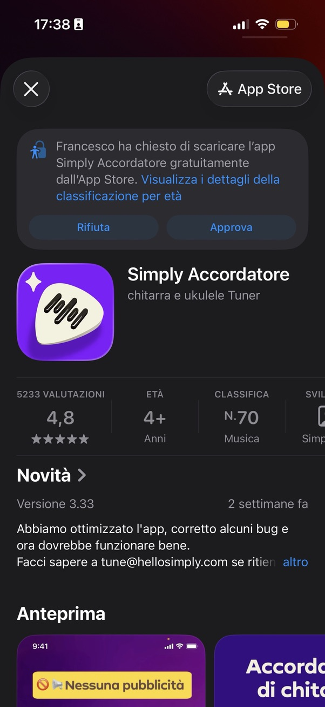

---

# 🙈 Limite Contenuti

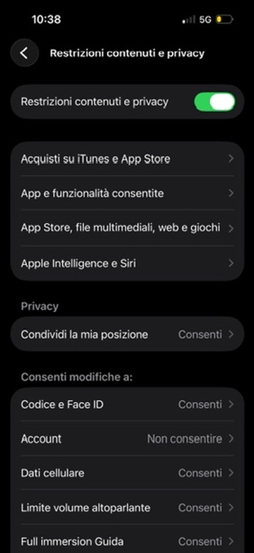

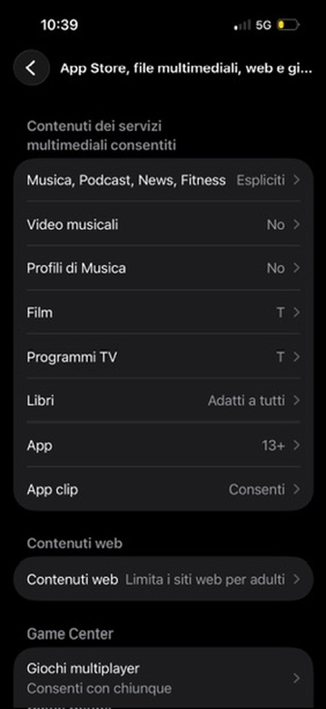

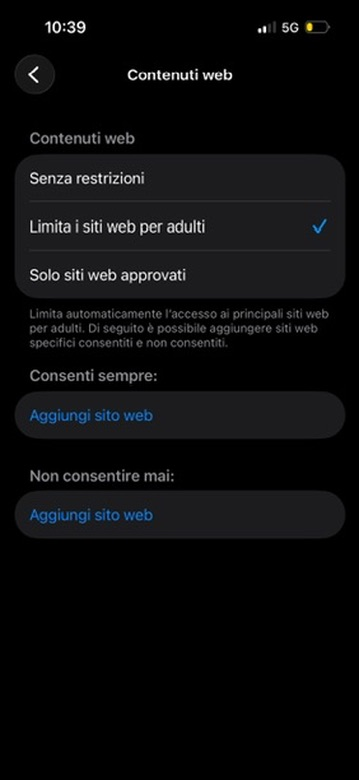

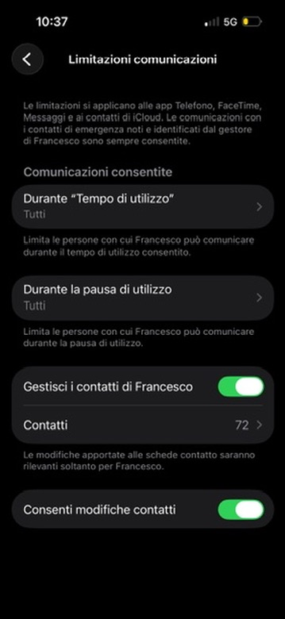

---

# 🤬 CSAM

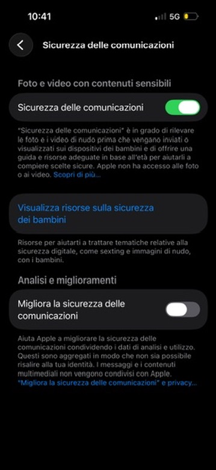

---

# Android: Google Family Link

## 📲 **Installazione**
1. **Genitore:** Scarica "Family Link (genitori)"
2. **Bambino:** Scarica "Family Link"
3. Segui procedura guidata
4. Crea account supervisionato

## 🎯 **Prima Configurazione**
- Collega dispositivo bambino
- Imposta regole base
- Configura filtri contenuti

---

# Family Link: Funzionalità (1)

## ⏱️ **Gestione Tempo**
- Limiti giornalieri per app
- Orari di blocco dispositivo
- Pausa istantanea remota

## 🛒 **Controllo Acquisti**
- Approvazione app Google Play
- Blocco acquisti in-app
- Gestione abbonamenti

---

# Family Link: Funzionalità (2)

## 🌐 **Filtri Web**
- Blocco siti inappropriati
- Whitelist/blacklist personalizzata
- SafeSearch attivo

## 📍 **Localizzazione**
- Posizione in tempo reale
- Cronologia spostamenti
- Notifiche arrivo/partenza

---

# Android: Controlli Google Play

## 🔒 **Restrizioni Contenuti**
1. **Google Play Store** → **Impostazioni**
2. **Controlli famiglia**
3. Imposta **classificazioni per età**

## 💳 **Sicurezza Acquisti**
- Richiedi password per acquisti
- Blocca acquisti in-app
- Notifiche acquisti

---

# ✅ Checklist Post-Configurazione

- [ ] Limiti tempo attivi
- [ ] Filtri contenuti funzionanti
- [ ] Approvazione acquisti attiva
- [ ] Geolocalizzazione configurata
- [ ] Test con i figli 
- [ ] Procedura per gestire le eccezioni
- [ ] Se configurato, verifica filto DNS

---

# 📅 Checklist Periodica

- [ ] Revisione app installate
- [ ] Verifica cronologia web
- [ ] Verifica chat
- [ ] Aggiornamento regole
- [ ] Dialogo con figli

---

# 🎮 Nintendo Switch

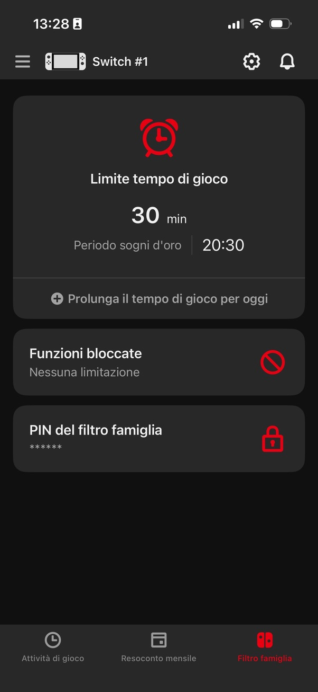

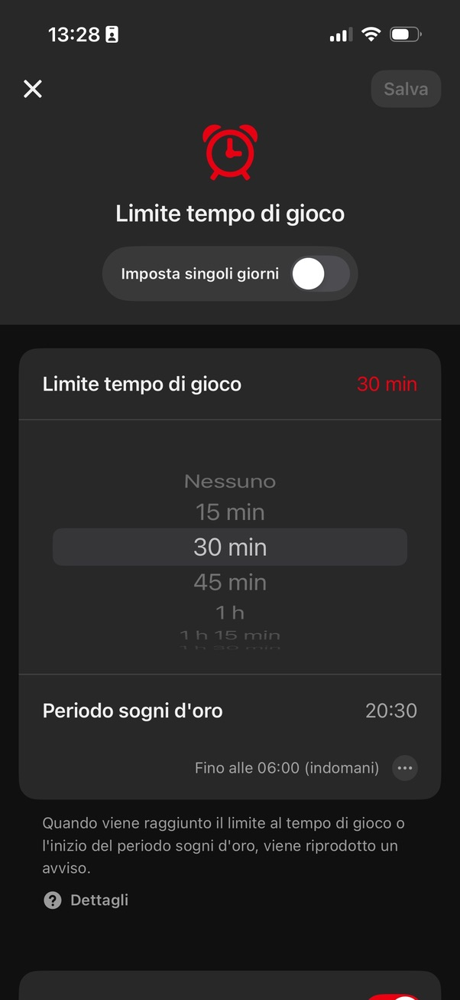

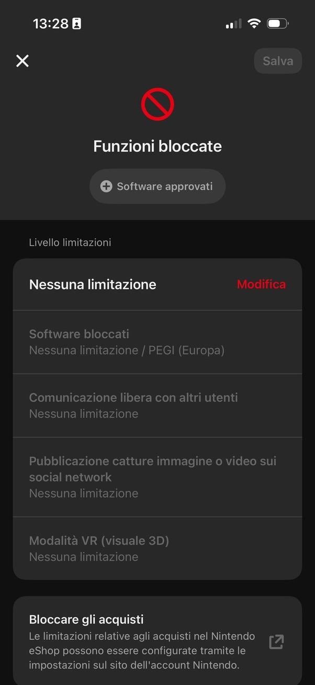

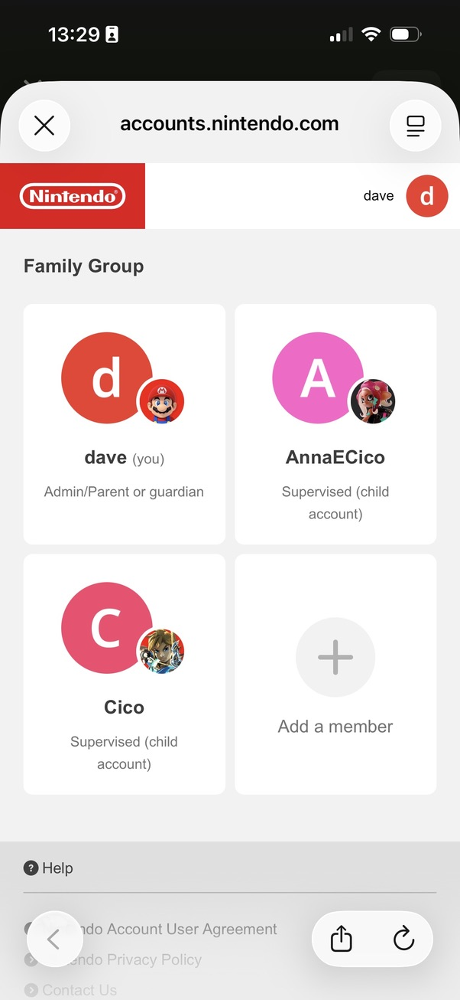

---

# 💬 WhatsApp

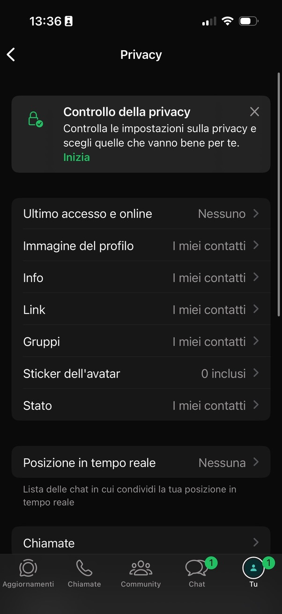

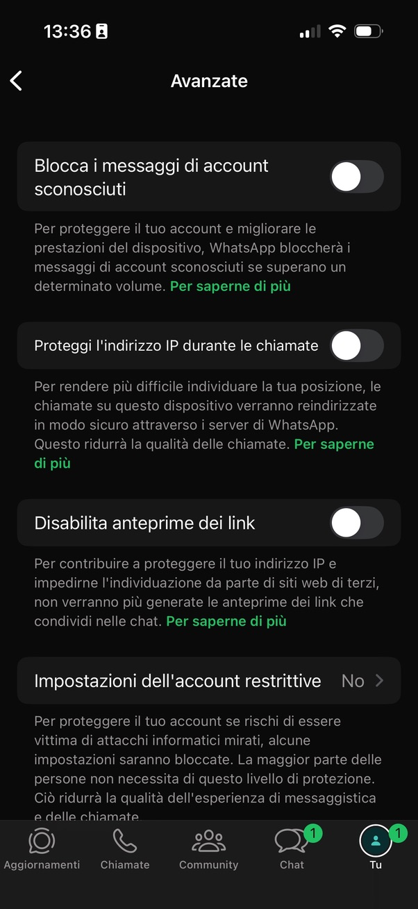

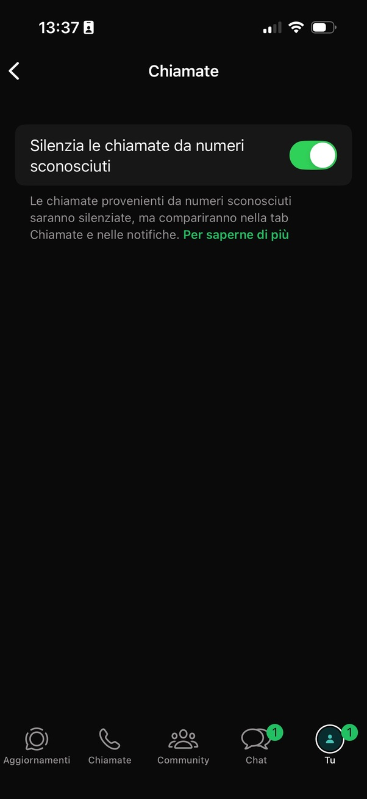

---

# 🚨 Le cose Veramente Importanti
- **Educazione** digitale prima dei filtri
- L'informatica è in **evoluzione costante**
- Non esiste la baccheta magica
- La sicurezza online è un **processo**, non un prodotto
- Filtri e limiti sono solo una parte del processo
- Ogni device e applicazione ragiona per conto suo
    ➡️ difficile riuscire a fare un discorso organico
- **Verifica continua e dialogo sono fondamentali**

---

# 🤔 Risorse e Supporto

## 📚 **Guide Ufficiali**
- Apple: Controlli parentali https://support.apple.com/it-it/HT201304
- Google: Family Link https://families.google/intl/it/familylink/

## 🆘 **Supporto Tecnico**
- **Email:** info@pattidigitalimanzoni.it
- **sito:** https://www.pattidigitalimanzoni.it

---

# 🙋‍♀️ Domande e Risposte

**Avete domande specifiche?**
**Problemi di configurazione?**
**Situazioni particolari?**

